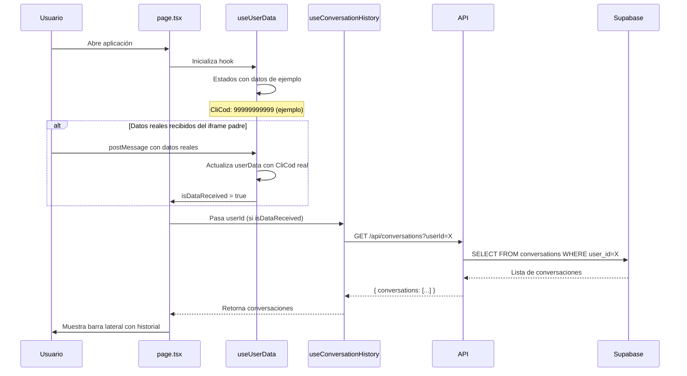
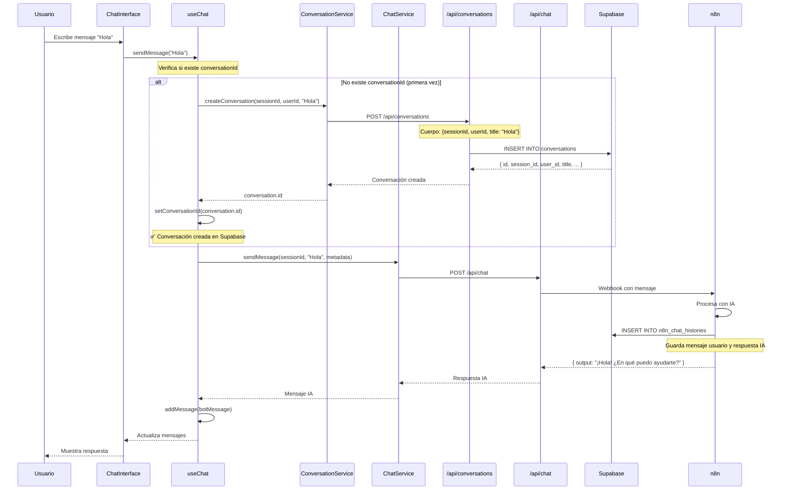
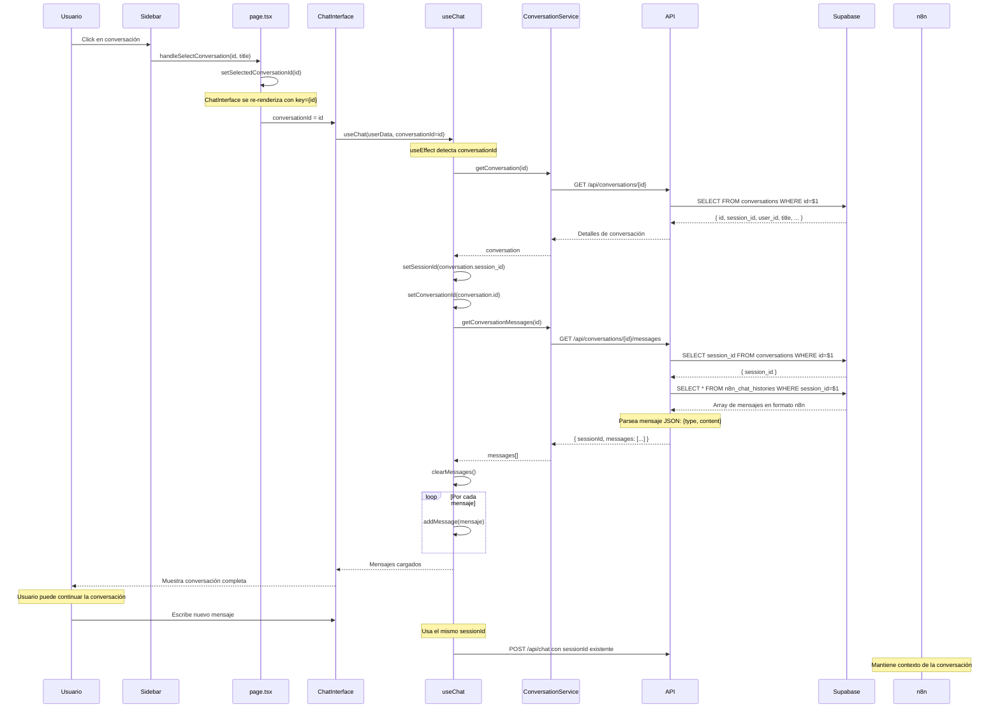
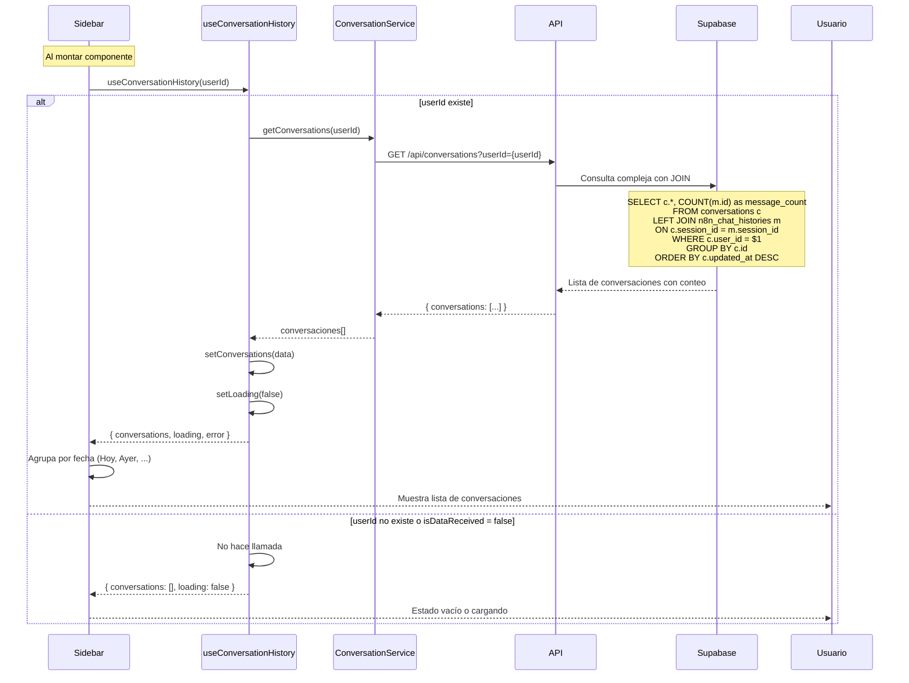
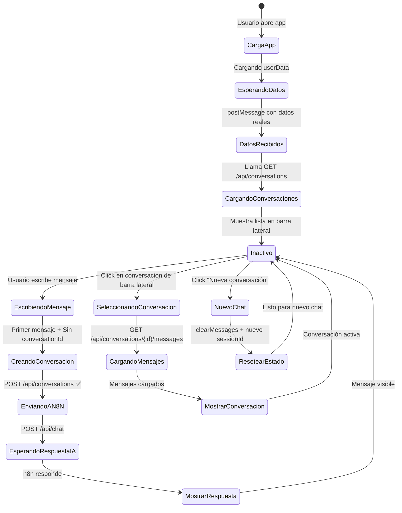

# Flujo de la Aplicación - Sistema de Gestión de Conversaciones

## Índice

1. [Arquitectura General](#arquitectura-general)
2. [Flujo: Nueva Conversación](#flujo-nueva-conversación)
3. [Flujo: Cargar Conversación Existente](#flujo-cargar-conversación-existente)
4. [Flujo: Listar Conversaciones](#flujo-listar-conversaciones)
5. [Endpoints de la API](#endpoints-de-la-api)
6. [Estructura de Datos](#estructura-de-datos)

---

## Arquitectura General

```mermaid
graph TB
    subgraph "Frontend - Next.js"
        A[page.tsx] --> B[ChatInterface]
        A --> C[Sidebar]
        B --> D[Hook useChat]
        C --> E[Hook useConversationHistory]
        D --> F[ConversationService]
        E --> F
        D --> G[ChatService]
    end

    subgraph "Backend - Rutas API"
        F --> H[/api/conversations]
        F --> I[/api/conversations/id]
        F --> J[/api/conversations/id/messages]
        G --> K[/api/chat]
    end

    subgraph "Base de Datos - Supabase PostgreSQL"
        H --> L[(conversations)]
        I --> L
        J --> L
        J --> M[(n8n_chat_histories)]
        K --> N[Flujo n8n]
        N --> M
    end

    style A fill:#e1f5ff
    style B fill:#e1f5ff
    style C fill:#e1f5ff
    style D fill:#fff3e0
    style E fill:#fff3e0
    style F fill:#f3e5f5
    style G fill:#f3e5f5
    style H fill:#e8f5e9
    style I fill:#e8f5e9
    style J fill:#e8f5e9
    style K fill:#e8f5e9
    style L fill:#fce4ec
    style M fill:#fce4ec
```

---

## Flujo: Nueva Conversación

### 1. Inicio de la Aplicación



### 2. Usuario Escribe Primer Mensaje



**Detalles Importantes:**

- El `sessionId` se genera automáticamente al montar `useChat`.
- La conversación se crea **solo en el primer mensaje** (cuando `conversationId === null`).
- El título de la conversación usa los primeros 100 caracteres del primer mensaje.
- n8n guarda TODOS los mensajes en `n8n_chat_histories` con el mismo `session_id`.

---

## Flujo: Cargar Conversación Existente

### 1. Usuario Selecciona Conversación de la Barra Lateral



**Puntos Clave:**

- Se obtiene el `session_id` de la tabla `conversations`.
- Se consultan los mensajes de `n8n_chat_histories` usando ese `session_id`.
- Los mensajes se parsean del formato n8n: `{type: "human"|"ai", content: "..."}`.
- Al continuar la conversación, se usa el **mismo sessionId** para que n8n mantenga el contexto.

---

## Flujo: Listar Conversaciones



---

## Endpoints de la API

### 1. POST /api/conversations

**Propósito:** Crear nueva conversación

**Petición (Request):**

```json
{
  "sessionId": "uuid-generado",
  "userId": "12345",
  "title": "Hola, necesito ayuda con..."
}
```

**Respuesta (Response):**

```json
{
  "id": "uuid",
  "session_id": "uuid-generado",
  "user_id": "12345",
  "title": "Hola, necesito ayuda con...",
  "created_at": "2025-12-03T15:00:00Z",
  "updated_at": "2025-12-03T15:00:00Z"
}
```

**Consulta SQL:**

```sql
INSERT INTO conversations (session_id, user_id, title)
VALUES ($1, $2, $3)
RETURNING id, session_id, user_id, title, created_at, updated_at
```

---

### 2. GET /api/conversations?userId={userId}

**Propósito:** Listar todas las conversaciones de un usuario

**Respuesta (Response):**

```json
{
  "conversations": [
    {
      "id": "uuid",
      "session_id": "uuid",
      "title": "Conversación sobre...",
      "created_at": "2025-12-03T14:00:00Z",
      "updated_at": "2025-12-03T15:00:00Z",
      "message_count": 12
    }
  ]
}
```

**Consulta SQL:**

```sql
SELECT
  c.id,
  c.session_id,
  c.title,
  c.created_at,
  c.updated_at,
  COUNT(m.id) as message_count
FROM conversations c
LEFT JOIN n8n_chat_histories m ON c.session_id = m.session_id
WHERE c.user_id = $1 AND c.is_active = true
GROUP BY c.id, c.session_id, c.title, c.created_at, c.updated_at
ORDER BY c.updated_at DESC
LIMIT 50
```

---

### 3. GET /api/conversations/{id}

**Propósito:** Obtener detalles de una conversación específica

**Respuesta (Response):**

```json
{
  "id": "uuid",
  "session_id": "uuid",
  "user_id": "12345",
  "title": "Título de la conversación",
  "created_at": "2025-12-03T14:00:00Z",
  "updated_at": "2025-12-03T15:00:00Z",
  "is_active": true
}
```

**Consulta SQL:**

```sql
SELECT id, session_id, user_id, title, created_at, updated_at, is_active
FROM conversations
WHERE id = $1
```

---

### 4. GET /api/conversations/{id}/messages

**Propósito:** Obtener todos los mensajes de una conversación

**Respuesta (Response):**

```json
{
  "sessionId": "uuid",
  "messages": [
    {
      "type": "human",
      "content": "Hola, necesito ayuda",
      "timestamp": "2025-12-03T15:00:00Z"
    },
    {
      "type": "ai",
      "content": "¡Hola! Claro, ¿en qué puedo ayudarte?",
      "timestamp": "2025-12-03T15:00:00Z"
    }
  ]
}
```

**Consultas SQL:**

```sql
-- 1. Obtener session_id de la conversación
SELECT session_id FROM conversations WHERE id = $1

-- 2. Obtener mensajes de n8n_chat_histories
SELECT id, message
FROM n8n_chat_histories
WHERE session_id = $1
ORDER BY id ASC
```

**Parseo de mensajes:**

```javascript
// El campo 'message' en n8n_chat_histories es JSON:
{
  "type": "human" | "ai",
  "content": "Texto del mensaje",
  "additional_kwargs": {},
  "response_metadata": {}
}

// Se convierte a:
{
  type: message.type === "human" ? "human" : "ai",
  content: message.content || "",
  timestamp: new Date()
}
```

---

### 5. PATCH /api/conversations/{id}

**Propósito:** Actualizar título de conversación

**Petición (Request):**

```json
{
  "title": "Nuevo título"
}
```

**Respuesta (Response):**

```json
{
  "id": "uuid",
  "session_id": "uuid",
  "user_id": "12345",
  "title": "Nuevo título",
  "created_at": "2025-12-03T14:00:00Z",
  "updated_at": "2025-12-03T15:30:00Z"
}
```

**Consulta SQL:**

```sql
UPDATE conversations
SET title = $1, updated_at = NOW()
WHERE id = $2
RETURNING id, session_id, user_id, title, created_at, updated_at
```

---

### 6. POST /api/chat

**Propósito:** Enviar mensaje a n8n para procesamiento con IA

**Petición (Request):**

```json
{
  "sessionId": "uuid",
  "chatInput": "¿Cuál es el clima hoy?",
  "metadata": {
    "CliCod": 12345,
    "PrdCod": 67890,
    "Email": "usuario@ejemplo.com",
    "userName": "Juan Pérez",
    "timestamp": "2025-12-03T15:00:00Z",
    "sessionId": "uuid",
    "IdUser": "user-id",
    "Document": "123456789",
    "FirstName": "Juan",
    "LastName": "Pérez",
    "role": "user",
    "domain": "ejemplo.com"
  }
}
```

**Respuesta (Response):**

```json
{
  "output": "El clima hoy está soleado con una temperatura de 25°C.",
  "components": [],
  "actions": []
}
```

**Flujo:**

```
Frontend → /api/chat → Webhook n8n → Procesamiento IA → n8n_chat_histories
                                    ↓
                              Respuesta IA
```

---

## Estructura de Datos

### Tabla: conversations

| Campo        | Tipo         | Descripción                                                            |
| ------------ | ------------ | ---------------------------------------------------------------------- |
| `id`         | UUID         | Clave primaria, generada automáticamente                               |
| `session_id` | VARCHAR(255) | Identificador único de sesión (compartido con n8n)                     |
| `user_id`    | VARCHAR(255) | ID del usuario (CliCod)                                                |
| `title`      | TEXT         | Título de la conversación (primeros 100 caracteres del primer mensaje) |
| `created_at` | TIMESTAMP    | Fecha de creación                                                      |
| `updated_at` | TIMESTAMP    | Última actualización (auto-actualizado con trigger)                    |
| `is_active`  | BOOLEAN      | Bandera de borrado lógico (true = activa)                              |

**Índices:**

- `idx_conversations_user_id` en `user_id`
- `idx_conversations_session_id` en `session_id` (ÚNICO)
- `idx_conversations_updated_at` en `updated_at DESC`

---

### Tabla: n8n_chat_histories (Administrada por n8n)

| Campo        | Tipo    | Descripción                                       |
| ------------ | ------- | ------------------------------------------------- |
| `id`         | SERIAL  | Clave primaria auto-incremental                   |
| `session_id` | VARCHAR | Identificador de sesión (mismo que conversations) |
| `message`    | JSONB   | Mensaje en formato n8n                            |

**Formato del campo `message`:**

```json
{
  "type": "human",
  "content": "Texto del mensaje del usuario",
  "additional_kwargs": {},
  "response_metadata": {}
}
```

o

```json
{
  "type": "ai",
  "content": "Respuesta del asistente IA",
  "additional_kwargs": {},
  "response_metadata": {}
}
```

---

## Flujo Completo: Nueva Conversación con Ciclo de Vida



---

## Resumen de Estados y Transiciones

### Estados del Sistema

1. **Sin Conversación (`conversationId = null`)**

   - Usuario puede escribir primer mensaje.
   - Al enviar → Crea conversación en Supabase.
   - Automáticamente transiciona a estado "Con Conversación".

2. **Con Conversación (`conversationId = UUID`)**

   - Conversación existe en base de datos.
   - Mensajes nuevos se asocian al mismo `session_id`.
   - n8n mantiene contexto de la conversación.

3. **Cargando Conversación**
   - Se obtiene `session_id` de `conversations`.
   - Se cargan mensajes de `n8n_chat_histories`.
   - Se restaura estado del chat.

### Eventos Principales

| Evento                  | Acción                            | Llamadas API                                                           |
| ----------------------- | --------------------------------- | ---------------------------------------------------------------------- |
| **Abrir App**           | Cargar historial                  | `GET /api/conversations?userId=X`                                      |
| **Primer Mensaje**      | Crear conversación + Enviar a n8n | `POST /api/conversations` + `POST /api/chat`                           |
| **Mensaje Subsecuente** | Solo enviar a n8n                 | `POST /api/chat`                                                       |
| **Click Conversación**  | Cargar detalles + mensajes        | `GET /api/conversations/{id}` + `GET /api/conversations/{id}/messages` |
| **Nueva Conversación**  | Resetear estado                   | Sin API (solo frontend)                                                |

---

## Diagramas de Componentes

### Jerarquía de Componentes

```
page.tsx
├── useUserData() ──────────────┐
├── useConversationHistory() ───┼─→ Estado global
│   ├── loading                 │
│   ├── conversations           │
│   └── selectedConversationId  │
├── Sidebar ────────────────────┘
│   ├── ConversationList
│   └── NewChatButton
└── ChatInterface
    ├── useChat()
    │   ├── sessionId
    │   ├── conversationId
    │   ├── messages
    │   └── sendMessage()
    ├── MessagesList
    │   └── Suggestions
    └── ChatInput
```

### Flujo de Datos

```
userData (CliCod) ─┐
                   ├─→ useConversationHistory ─→ ConversationService ─→ API
                   │
                   └─→ ChatInterface ─→ useChat ─→ ConversationService ─→ API
                                              └─→ ChatService ─→ API
```

---

## Consideraciones Técnicas

### 1. Gestión de Estado

- **Estado React**: Mensajes, estados de carga, conversationId.
- **Keys de React**: `key={selectedConversationId}` fuerza re-render al cambiar conversación.
- **useEffect**: Detecta cambios en conversationId para cargar/limpiar mensajes.

### 2. Optimizaciones

- Pool de conexiones en PostgreSQL (max: 20 conexiones).
- Consultas con índices para rendimiento.
- Límite de 50 conversaciones en listado.

### 3. Seguridad

- Filtrado por `user_id` en todas las consultas.
- SSL/TLS en conexiones a Supabase.
- Validación de parámetros en rutas API.

### 4. Manejo de Errores

- Try-catch en todos los endpoints.
- Estados de error en hooks.
- Registro detallado (logging) en consola.
